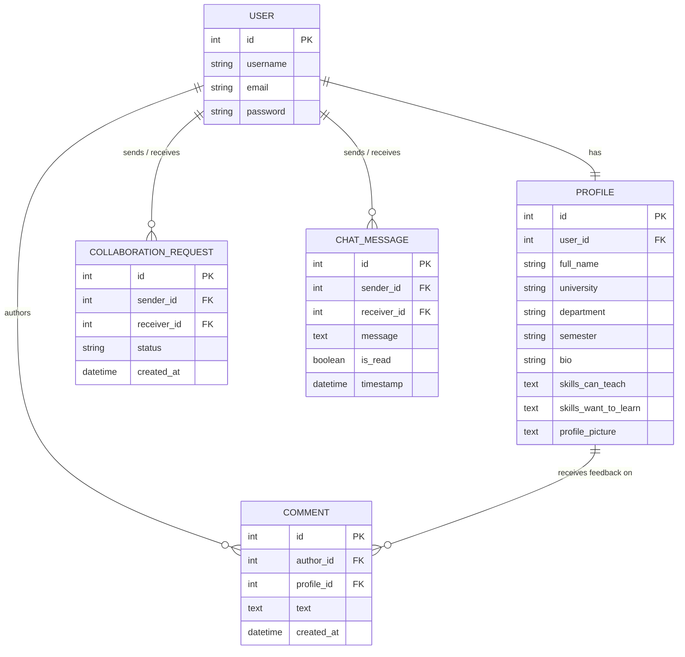

# The Common Room

<div align="center">

### *where students learn, collaborate & grow together*


</div>

---

## 1. Project Overview

**The Common Room** is a peer-to-peer campus collaboration platform designed to connect university students for peer tutoring, skill sharing, and academic project partnerships.

The application allows students to create detailed academic profiles, list skills they can teach and skills they want to learn, discover compatible study partners, and communicate safely through private 1-on-1 messaging.

---

## 2. Problem Statement

In university environments, students often face several challenges when trying to collaborate:

1. **Skill Discovery Gap**: Students frequently struggle to find peers who possess specific technical or academic skills they need to learn.
2. **Fragmented Communication**: Finding study partners across different departments usually happens through unstructured group chats, leading to lost requests and low response rates.
3. **Lack of Privacy Controls**: Unfiltered contact details make it difficult for students to connect safely without first establishing a mutual collaboration agreement.

---

## 3. Objectives

The primary goals of **The Common Room** are:

- **Facilitate Peer Learning**: Enable students to exchange knowledge by matching skills they can teach with skills others want to learn.
- **Automate Partner Matching**: Provide an intelligent match engine that highlights mutual learning opportunities between peers.
- **Provide a Secure Environment**: Protect user privacy by requiring accepted collaboration requests before unlocking direct messaging and profile feedback.
- **Ensure High Security Standards**: Implement dual sign-in support, strong password validation policies, and secure token-based authentication.

---

## 4. Entity Relationship (ER) Diagram



---

## 5. Database Model Overview

| Entity | Model Name | Description | Key Attributes |
|---|---|---|---|
| User Credentials | `User` | Built-in Django authentication model | `username`, `email`, `password` |
| Student Profile | `Profile` | Extended student metadata and portfolios | `university`, `department`, `semester`, `skills_can_teach`, `skills_want_to_learn`, `profile_picture` |
| Collaboration Request | `CollaborationRequest` | Formal connection state between two peers | `sender`, `receiver`, `status` (`pending`/`accepted`/`declined`) |
| Peer Feedback | `Comment` | Comments posted on collaborator profiles | `author`, `profile`, `text`, `created_at` |
| Private Messaging | `ChatMessage` | 1-on-1 direct messages between peers | `sender`, `receiver`, `message`, `is_read`, `timestamp` |

---

## 6. System Requirements

### 6.1 Functional Requirements

- **User Authentication & Access Control**
  - Registration with full name, university email, department, and password.
  - Dual sign-in support allowing login using either **Username OR Email address**.
  - Password security enforcing 5 rules (8+ characters, uppercase, lowercase, digit, special character).
  - Real-time password requirement checklist and password visibility toggles.
  - Password recovery interface via `/forgot-password`.

- **Profile & Portfolio Customization**
  - Create and edit student profiles including bio, university, department, and semester.
  - Publish lists of "Skills I Can Teach" and "Skills I Want to Learn".
  - Upload avatar photos processed through client-side canvas image scaling.

- **Skill Exchange Match Engine**
  - Automatically evaluate overlap between user skill portfolios.
  - Display "Potential Skill Exchange Match" banners when mutual teaching/learning synergies exist.

- **Collaboration Request Workflow**
  - Send, view, accept, or decline peer collaboration requests.
  - Prevent duplicate or self-directed requests.
  - Real-time status indicators across student cards (Pending Sent, Pending Received, Connected).

- **1-on-1 Messaging & Feedback**
  - Private messaging split-view interface accessible exclusively to accepted collaborators.
  - Message status receipts (Delivered vs. Seen) and navigation bar unread counter badges.
  - Profile comments system restricted to verified student collaborators.

- **Student Directory & Search**
  - Search students by name, department, university, bio, or specific skills.
  - One-click filter chips for popular technical and academic topics.

---

### 6.2 Non-Functional Requirements

- **Security**: Sensitive data protection using PBKDF2 password hashing, JWT authorization headers, and backend validation guards.
- **Usability**: Responsive user interface supporting dark and light themes, clean typography, and intuitive navigation.
- **Performance**: Lightweight API response payloads and client-side image compression for fast page load times.
- **Reliability & Data Integrity**: Foreign key constraints and transaction safety enforced through Django ORM and PostgreSQL.

---

## 7. System Architecture & Request Data Flow

1. **Client Interface**: User interacts with Next.js App Router components.
2. **API Communication**: Axios sends HTTP requests attached with `Authorization: Bearer <JWT_Access_Token>` headers.
3. **Backend Middleware & Security**: Django REST Framework authenticates tokens, verifies permissions, and validates payloads.
4. **Database Operations**: Django ORM performs safe parameterized queries against PostgreSQL.

---

## 8. Application Pages

| Route | Description |
|---|---|
| `/` | Landing homepage detailing platform capabilities with auth-aware actions. |
| `/login` | Dual username/email sign-in page with password visibility toggles. |
| `/register` | Registration page with live 5-rule password checklist and confirmation matching. |
| `/forgot-password` | Password recovery page enforcing security compliance. |
| `/dashboard` | Student hub displaying profile summary, skill cards, and request management. |
| `/students` | Student Directory featuring search, skill filter chips, and peer profile cards. |
| `/students/[id]` | Peer profile detail page highlighting Skill Matches, request actions, and comments. |
| `/profile/edit` | Profile edit page for academic info, avatar upload, and security updates. |
| `/chat` | Private 1-on-1 messaging interface with read receipts and active peer list. |

---

## 9. Tech Stack

### Frontend
- **Framework**: Next.js (App Router)
- **Language**: TypeScript
- **Styling**: Tailwind CSS v4
- **Icon System**: Lucide React (`lucide-react`)

### Backend
- **Framework**: Django 6
- **API Framework**: Django REST Framework
- **Authentication**: SimpleJWT (`rest_framework_simplejwt`)

### Database
- **Engine**: PostgreSQL (`commonroom_db`)

---

## 10. Project Structure

```text
TheCommonRoom/
├── backend/
│   ├── accounts/          # User registration, dual login, password validation & reset
│   ├── profiles/          # Student profile management & avatar storage
│   ├── collaborations/    # Collaboration request workflow (pending/accepted/declined)
│   ├── posts/             # Profile collaborator feedback comments
│   ├── chat/              # 1-on-1 private messaging, unread counts & read receipts
│   └── common_room_backend/ # Django project configuration & settings
│
└── frontend/
    ├── app/               # Next.js App Router pages
    │   ├── page.tsx           # Auth-aware landing homepage
    │   ├── dashboard/         # Student dashboard hub
    │   ├── login/             # Dual sign-in page
    │   ├── register/          # User registration page
    │   ├── forgot-password/   # Password recovery page
    │   ├── profile/edit/      # Edit profile & security settings page
    │   ├── chat/              # 1-on-1 realtime messaging page
    │   └── students/
    │       ├── page.tsx       # Browse student directory
    │       └── [id]/          # Peer student profile & match detail page
    ├── components/
    │   ├── Navbar.tsx         # Persistent navigation bar & theme toggle
    │   └── Avatar.tsx         # Multi-size avatar & initials fallback component
    ├── utils/
    │   └── passwordValidation.ts # Shared password security criteria evaluator
    └── services/
        ├── api.ts             # Axios instance configuration
        └── auth.ts            # REST API service functions
```

---

## 11. Local Development Setup

### 1. Prerequisites
- Python 3.10+
- Node.js 18+
- PostgreSQL database (`commonroom_db`)

---

### 2. Backend Setup

1. Navigate to the `backend` directory:
   ```bash
   cd backend
   ```

2. Create and activate a virtual environment:
   ```bash
   python -m venv venv
   # On Windows:
   venv\Scripts\activate
   # On macOS/Linux:
   source venv/bin/activate
   ```

3. Install requirements:
   ```bash
   pip install django djangorestframework djangorestframework-simplejwt django-cors-headers psycopg2-binary requests
   ```

4. Configure PostgreSQL in `common_room_backend/settings.py`:
   ```python
   DATABASES = {
       'default': {
           'ENGINE': 'django.db.backends.postgresql',
           'NAME': 'commonroom_db',
           'USER': 'postgres',
           'PASSWORD': '54321',
           'HOST': 'localhost',
           'PORT': '5432',
       }
   }
   ```

5. Run database migrations:
   ```bash
   python manage.py migrate
   ```

6. Start the Django backend server:
   ```bash
   python manage.py runserver 8000
   ```
   > Backend API runs at `http://127.0.0.1:8000/api/`

---

### 3. Frontend Setup

1. Navigate to the `frontend` directory in a new terminal:
   ```bash
   cd frontend
   ```

2. Install dependencies:
   ```bash
   npm install
   ```

3. Start the Next.js development server:
   ```bash
   npm run dev
   ```
   > Frontend runs at `http://localhost:3000/`

---

## 12. Automated Testing

Run the test suite in `backend/`:

- **Password Validation Unit Tests**:
  ```bash
  python test_password_validation.py
  ```
- **Django Configuration Check**:
  ```bash
  python manage.py check
  ```
- **Stage 1–8 Full System Tests**:
  ```bash
  python test_stage1.py
  python test_stage8.py
  ```

---

## 13. Future System Roadmap

- **WebSocket Communication**: Upgrade chat polling to Django Channels + WebSockets for instant streaming.
- **Study Sessions Scheduler**: Interactive calendar to schedule group study slots.
- **Push Notifications**: Live browser alerts for incoming requests and unread messages.

---

## 14. License

This project is open-source and available under the [MIT License](https://opensource.org/licenses/MIT).
