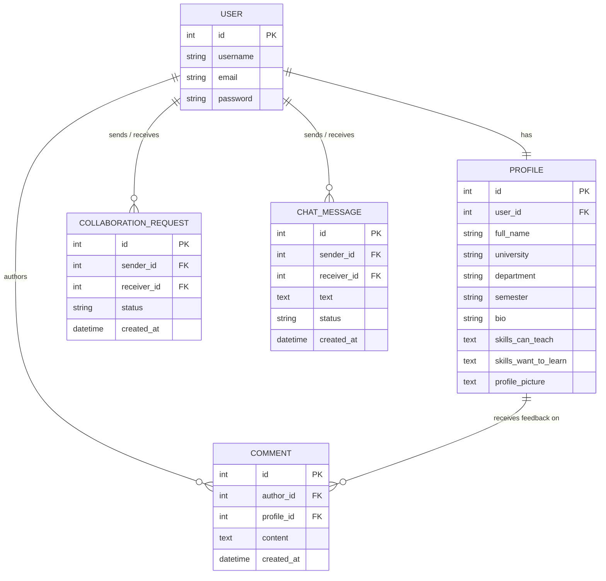

# The Common Room

<div align="center">

### *A Peer-to-Peer Campus Skill Sharing & Academic Collaboration Platform*

[](https://thecommonroom-hub.vercel.app)
[](https://thecommonroom-hub.netlify.app)
[](https://thecommonroom-backend.onrender.com)
[](https://neon.tech)
[](https://thecommonroom-backend.onrender.com/admin/login/)

[](https://nextjs.org/)
[](https://react.dev/)
[](https://www.typescriptlang.org/)
[](https://tailwindcss.com/)
[](https://www.djangoproject.com/)
[](https://www.django-rest-framework.org/)
[](https://django-rest-framework-simplejwt.readthedocs.io/)

</div>

---

## 🌐 Live Production Links

| Service | Platform | Live URL |
| :--- | :--- | :--- |
| **Frontend (Primary)** | Vercel Cloud | 🚀 **[https://thecommonroom-hub.vercel.app](https://thecommonroom-hub.vercel.app)** |
| **Frontend (Mirror)** | Netlify Edge | 🌐 **[https://thecommonroom-hub.netlify.app](https://thecommonroom-hub.netlify.app)** |
| **Backend API** | Render Web Service | ⚡ `https://thecommonroom-backend.onrender.com/api/` |
| **Database** | Neon Serverless Cloud | 🐘 PostgreSQL 16 (Singapore AWS) |
| **24/7 Keepalive** | UptimeRobot | 🟢 Active HTTP Monitor |

---

## 1. Project Overview

**The Common Room** is a campus collaboration platform designed to connect university students for peer tutoring, technical skill sharing, and academic project partnerships.

Students create academic profiles, list skills they can teach and skills they want to learn, discover peer matches through an automated matching engine, send collaboration requests, chat in real-time with accepted study buddies, and receive verified peer endorsements.

---

## 2. Key Features

- ** Robust Authentication & Security**:
  - Dual sign-in supporting **Username OR University Email**.
  - Complex 5-rule password validation (8+ characters, uppercase, lowercase, numbers, special characters).
  - JWT Access and Refresh token lifecycle with automatic bearer header injection.
  - Password recovery and reset flow via `/forgot-password`.

- ** Interactive Profile & Skills Tag System**:
  - **Tag / Pill Input Box**: Type a skill and press `Enter`, `Comma`, or `+ Add` to create badges with 1-click `✕` deletion.
  - **Multi-Delimiter Parser**: Automatically parses and splits pasted lists across commas, semicolons, line breaks, pipes, and bullet points.
  - **Avatar Toolbar**: Instant image upload, client-side canvas scaling, and 1-click photo removal with gradient initials avatar fallback.

- ** Automated Skill Matching Engine**:
  - Automatically calculates reciprocal learning opportunities (`can_teach_to_peer` and `can_learn_from_peer`) between students.
  - Highlights compatibility match banners across the student directory.

- ** 3-Tab Student Command Dashboard**:
  - **Collaboration Requests**: Tab for incoming and outgoing collaboration requests with 1-click Accept/Decline actions.
  - **Peer Endorsements**: Read-only testimonial feed left by verified campus study buddies.
  - **My Overview**: 4-KPI live metric grid tracking connected peers, skills taught, skills to learn, and endorsements.

- ** Real-Time 1-on-1 Messaging**:
  - In-app direct chat exclusively unlocked between accepted collaborators.
  - Intelligent scroll preservation (polling never pulls users down while reviewing past message history).
  - Visual message alignment (sent in indigo on the right, received on the left) and live unread counter badges.

- ** Fully Responsive Mobile Drawer Navigation**:
  - Adaptive layout across smartphones, tablets (including iPad Mini), laptops, and desktop monitors.
  - Collapsible mobile drawer menu featuring an integrated **3-Way Appearance Switcher** (☀️ Light, 🌙 Dark, 💻 System Device Match).

---

## 3. Tech Stack

### Frontend
- **Framework**: Next.js 16.1.6 (App Router)
- **Language**: TypeScript 5.x
- **UI & Styling**: Tailwind CSS v4, Vanilla CSS Custom Design System
- **Icons**: Lucide React (`lucide-react`)
- **HTTP Client**: Axios with JWT Bearer Interceptors
- **Hosting**: Vercel & Netlify

### Backend
- **Framework**: Python 3.10+ / Django 5.x
- **API Engine**: Django REST Framework (DRF)
- **Authentication**: SimpleJWT (`rest_framework_simplejwt`)
- **CORS Handling**: `django-cors-headers`
- **WSGI Server**: Gunicorn & WhiteNoise
- **Hosting**: Render (Web Service)

### Database & Cloud
- **Engine**: PostgreSQL 16 (Neon Serverless AWS Singapore)
- **Local Fallback**: SQLite (`db.sqlite3`)

---

## 4. Entity Relationship (ER) Diagram



---

## 5. Application Routes

| Route | Description |
| :--- | :--- |
| `/` | Auth-aware landing page with platform highlights and call-to-actions. |
| `/login` | Dual username/email sign-in with password visibility toggles. |
| `/register` / `/signup` | Registration page with live 5-rule password strength checklist. |
| `/forgot-password` | Account recovery and password reset. |
| `/dashboard` | 3-Tab command center (Requests, Feedback, Overview KPIs). |
| `/students` | Student Directory with keyword search, skill pills, and match badges. |
| `/students/[id]` | Peer profile detail with reciprocal skill matrix and testimonial trigger. |
| `/profile/edit` | Academic metadata editor, avatar toolbar, and interactive skill tag box. |
| `/chat` | 1-on-1 messaging interface with collaborator badges and unread counter. |

---

## 6. Project Directory Structure

```text
TheCommonRoom/
├── backend/
│   ├── accounts/              # Registration, dual login, password validation & reset
│   ├── profiles/              # Student profile management, skills match serializer & avatar storage
│   ├── collaborations/        # Collaboration request workflow (pending/accepted/declined)
│   ├── posts/                 # Verified collaborator testimonials & endorsements
│   ├── chat/                  # 1-on-1 messaging, unread counts & message history
│   └── common_room_backend/   # Django project settings & database configuration
│
└── frontend/
    ├── app/                   # Next.js App Router pages
    │   ├── page.tsx               # Responsive landing homepage
    │   ├── dashboard/             # 3-Tab student dashboard hub
    │   ├── login/                 # Sign-in page
    │   ├── register/              # Registration page
    │   ├── forgot-password/       # Password reset page
    │   ├── profile/edit/          # Profile editor with Interactive Skill Tag Box
    │   ├── chat/                  # Real-time messaging page
    │   └── students/              # Student directory & peer profile details
    ├── components/
    │   ├── Navbar.tsx             # Responsive navbar with mobile drawer & 3-way theme switcher
    │   └── Avatar.tsx             # Image avatar with dynamic initials gradient fallback
    ├── utils/
    │   └── passwordValidation.ts  # Shared password complexity rules
    └── services/
        ├── api.ts                 # Axios client instance
        └── auth.ts                # REST API service functions
```

---

## 7. Local Development Setup

### 1. Prerequisites
- Python 3.10+
- Node.js 18+
- PostgreSQL or SQLite

---

### 2. Backend Setup

1. Navigate to `backend`:
   ```bash
   cd backend
   ```

2. Create and activate a virtual environment:
   ```bash
   # Windows:
   python -m venv venv
   venv\Scripts\activate

   # macOS/Linux:
   python3 -m venv venv
   source venv/bin/activate
   ```

3. Install dependencies:
   ```bash
   pip install -r requirements.txt
   ```

4. Run database migrations:
   ```bash
   python manage.py migrate
   ```

5. Start the backend server:
   ```bash
   python manage.py runserver 8000
   ```
   > Backend API will be available at `http://127.0.0.1:8000/api/`

---

### 3. Frontend Setup

1. Navigate to `frontend` in a new terminal:
   ```bash
   cd frontend
   ```

2. Install dependencies:
   ```bash
   npm install
   ```

3. Start the Next.js development server:
   ```bash
   npm run dev
   ```
   > Frontend will run at `http://localhost:3000/`

---

## 8. Testing Suite

Run backend validation test scripts in `backend/`:

```bash
# Password Security Validator:
python test_password_validation.py

# Django Configuration Check:
python manage.py check

# Full System Integration Stages:
python test_stage1.py
python test_stage8.py
```

Run frontend type check in `frontend/`:

```bash
npx tsc --noEmit
```

---

## 9. License

This project is open-source and licensed under the [MIT License](https://opensource.org/licenses/MIT).
