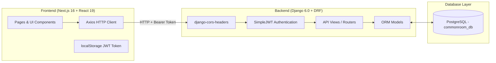

# 🎓 Stage 1 & 2 Learning & Architecture Report
### *The Common Room — Full-Stack Django & Next.js Platform*

This comprehensive guide breaks down everything implemented in **Stage 1** and **Stage 2**. Use this reference for your university presentation, project report, and viva defense!

---

## 🏛️ 1. Project Architecture Overview



---

## 🔑 2. Stage 1 Deep-Dive: Authentication & Foundation

### A. Key Concepts Implemented
1. **Django Built-in User Model (`django.contrib.auth.models.User`)**:
   * Uses PBKDF2 with SHA-256 password hashing. Passwords are **never stored in plain text**.
   * Handled safely in `accounts/serializers.py` using `User.objects.create_user()`.

2. **JSON Web Token (JWT) Authentication (`djangorestframework-simplejwt`)**:
   * **Access Token**: Short-lived cryptographic token attached to HTTP headers: `Authorization: Bearer <access_token>`.
   * **Refresh Token**: Long-lived token used to obtain a new access token without re-entering credentials.

3. **Django Signals (`post_save`)**:
   * Located in `profiles/models.py`.
   * Automatically creates a `Profile` record in the database the exact instant a new `User` account is created:
     ```python
     @receiver(post_save, sender=User)
     def create_or_update_user_profile(sender, instance, created, **kwargs):
         if created:
             Profile.objects.create(user=instance, full_name=instance.username)
     ```

4. **Cross-Origin Resource Sharing (CORS)**:
   * Configured via `django-cors-headers` in `settings.py`.
   * Allows the frontend running at `http://localhost:3000` to securely call the Django backend running at `http://127.0.0.1:8000`.

### B. Stage 1 API Endpoints Summary

| Endpoint | Method | Request Payload | Response |
|---|---|---|---|
| `/api/accounts/register/` | `POST` | `{ username, email, password }` | `201 Created` (`{ user: { id, username, email } }`) |
| `/api/token/` | `POST` | `{ username, password }` | `200 OK` (`{ access, refresh }`) |
| `/api/accounts/me/` | `GET` | *(Bearer Token)* | `200 OK` (`{ id, username, email }`) |
| `/api/profiles/me/` | `GET / PUT` | *(Bearer Token)* | `200 OK` (Profile object with academic fields) |

---

## 📚 3. Stage 2 Deep-Dive: Directory, Profiles & PostgreSQL

### A. Key Concepts Implemented
1. **Database Migration to PostgreSQL (`commonroom_db`)**:
   * Switched Django database engine from SQLite to `django.db.backends.postgresql` using `psycopg2-binary`.
   * Production-grade relational database running on `localhost:5432`.

2. **Student Directory Filtering (`GET /api/profiles/`)**:
   * Uses Django ORM query `Profile.objects.exclude(user=request.user)`.
   * Returns all student profiles except the active logged-in student, preventing self-matching in the directory.

3. **Flexible Profile Lookup (`GET /api/profiles/<id>/`)**:
   * Supports profile lookup by both `Profile.id` and `User.id` for robust frontend compatibility.
   * Returns HTTP `404 Not Found` if the student profile does not exist.

4. **Next.js Frontend Integration**:
   * Connected `frontend/app/students/page.tsx` to query `/api/profiles/` using `getAllProfiles(token)`.
   * Connected `frontend/app/students/[id]/page.tsx` to query `/api/profiles/<id>/` using `getProfileById(id, token)`.

### B. Stage 2 API Endpoints Summary

| Endpoint | Method | Security | Purpose |
|---|---|---|---|
| `/api/profiles/` | `GET` | `IsAuthenticated` (JWT) | List student profiles for Campus Directory |
| `/api/profiles/<id>/` | `GET` | `IsAuthenticated` (JWT) | Retrieve individual student profile details |

---

## 🎯 4. University Defense & Viva Presentation Q&A

### Q1: Why did you use JWT instead of Session Authentication?
> **Answer**: Session authentication relies on server-side session state and cookies. JWT is stateless, scalable, and ideal for modern single-page applications (SPAs) like Next.js because the backend doesn't need to store session state in memory or database on every HTTP request.

### Q2: How does automatic profile creation work?
> **Answer**: We use Django's `post_save` signal. Whenever a `User` model instance is saved with `created=True`, Django triggers our signal handler function `create_or_update_user_profile`, which instantiates a matching `Profile` record tied via a `OneToOneField`.

### Q3: Why is CORS necessary?
> **Answer**: Browsers enforce the Same-Origin Policy for security. Since Next.js runs on port `3000` and Django runs on port `8000`, the browser considers them different origins. `django-cors-headers` adds the `Access-Control-Allow-Origin: http://localhost:3000` header to backend responses, allowing the browser to read the data.

### Q4: How does the student directory exclude the logged-in user?
> **Answer**: In Django ORM, we use `Profile.objects.exclude(user=request.user)`. The backend identifies `request.user` from the decrypted JWT token sent in the `Authorization: Bearer <token>` header.

---

## 📋 5. Summary of Completed Project Milestones

```
✅ Stage 1: Django Setup + User Registration + JWT Token Auth + SQLite -> 100% COMPLETE
✅ Stage 1.5: Switch Database Engine to PostgreSQL (commonroom_db) -> 100% COMPLETE
✅ Stage 2: Student Directory API + Individual Profile API + Next.js Integration -> 100% COMPLETE
⏳ Stage 3: Collaboration Requests Engine (Pending Approval)
```
