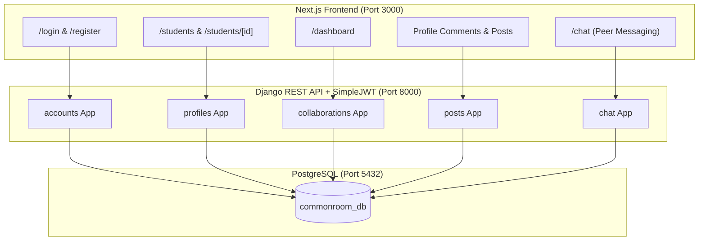

# 🎓 The Common Room — Stages 1–5 Comprehensive Completion Report
> **Project**: The Common Room (Full-Stack Campus Collaboration Platform)  
> **Tech Stack**: Next.js (TypeScript, Tailwind CSS) + Django REST Framework + PostgreSQL (`commonroom_db`)  
> **Date**: August 14, 2026  
> **Status**: Stages 1 through 5 Fully Implemented, Tested, & Verified (100% Pass Rate)

---

## 📌 Executive Summary
This document provides a complete technical report of the work completed across **Stages 1 through 5** for **The Common Room**. 

The application has been successfully transformed from a frontend-first prototype into a production-grade full-stack architecture backed by **Django REST Framework** and **PostgreSQL**. All backend apps, database schemas, authorization guards, API routes, and Next.js frontend pages have been thoroughly integrated and validated using automated regression test suites.

---

## 🚀 Completed Stages Overview



---

## 🔑 Stage 1: Authentication & User Profile Foundation

### Objectives & Deliverables
* **Django Project Setup**: Re-established Django project structure in `backend/` with `corsheaders` configured for `http://localhost:3000`.
* **JWT Authentication**: Configured `djangorestframework-simplejwt` for secure token generation (`/api/token/`) and refresh (`/api/token/refresh/`).
* **User Registration**: Created `POST /api/accounts/register/` using Django's built-in `User` model with strong password hashing (`PBKDF2PasswordHasher`).
* **Profile Generation**: Created `profiles` app with a `Profile` model connected via Django `post_save` signals to automatically initialize student profiles upon registration.

### Key Endpoints
| HTTP Method | Route | Description | Auth Required |
|---|---|---|---|
| `POST` | `/api/accounts/register/` | Register new student account | ❌ No |
| `POST` | `/api/token/` | Obtain JWT Access & Refresh Tokens | ❌ No |
| `POST` | `/api/token/refresh/` | Refresh expired access token | ❌ No |
| `GET` | `/api/accounts/me/` | Fetch authenticated user data | `Bearer JWT` |
| `GET` | `/api/profiles/me/` | Fetch authenticated student profile | `Bearer JWT` |
| `PUT` | `/api/profiles/me/` | Update profile details (bio, skills, university) | `Bearer JWT` |

---

## 🗄️ Stage 2: Database Migration to PostgreSQL & Student Directory

### Objectives & Deliverables
* **PostgreSQL Engine Migration**: Successfully transitioned the project database from SQLite to PostgreSQL (`commonroom_db`, user: `postgres`, host: `localhost`, port: `5432`).
* **Student Directory API**: Implemented `GET /api/profiles/` to supply real student profiles to the campus directory.
* **Student Detail API**: Implemented `GET /api/profiles/<id>/` supporting both User ID and Profile ID lookups.
* **Next.js Integration**: Connected `/students` directory and `/students/[id]` detail pages to fetch dynamic backend data.

### Key Endpoints
| HTTP Method | Route | Description | Auth Required |
|---|---|---|---|
| `GET` | `/api/profiles/` | List all available student profiles | `Bearer JWT` |
| `GET` | `/api/profiles/<id>/` | Get detailed profile of a specific student | `Bearer JWT` |

---

## 🤝 Stage 3: Collaboration Request System

### Objectives & Deliverables
* **`collaborations` App**: Created `CollaborationRequest` model with `sender`, `receiver`, `skills`, `status` (`'pending'`, `'accepted'`, `'rejected'`, `'declined'`), and timestamps.
* **Request Lifecyle Management**: Allowed students to send, view sent/received requests, accept requests, and decline requests.
* **Authorization Guards**:
  * Blocked users from sending collaboration requests to themselves.
  * Prevented duplicate pending requests between the same pair of students.
  * Restricted status modifications (`PATCH`) strictly to the recipient.
* **Dashboard Integration**: Wired Next.js `/dashboard` page to load live collaboration requests and handle status updates.

### Key Endpoints
| HTTP Method | Route | Description | Auth Required |
|---|---|---|---|
| `POST` | `/api/collaborations/create/` | Send collaboration request to a student | `Bearer JWT` |
| `GET` | `/api/collaborations/sent/` | List requests sent by active user | `Bearer JWT` |
| `GET` | `/api/collaborations/received/` | List requests received by active user | `Bearer JWT` |
| `PATCH` | `/api/collaborations/<id>/` | Accept or decline collaboration request | `Bearer JWT` |
| `GET` | `/api/collaborations/status/<user_id>/` | Query collaboration status between active user and peer | `Bearer JWT` |

---

## 📝 Stage 4: Posts & Comments Backend System

### Objectives & Deliverables
* **`posts` App**: Created `Post` and `Comment` models with foreign key links to `User` and `Profile`.
* **Posts & Comments REST APIs**: Built full CRUD endpoints for creating posts, viewing post feeds, reading single post details with nested comments, and adding/deleting comments.
* **Authorization & Validation**:
  * Enforced strict content validation (rejecting empty/whitespace-only content with `400 Bad Request`).
  * Restricted deletion of posts and comments strictly to their original authors (`403 Forbidden`).
* **Profile Feedback Integration**: Added `/api/posts/profile/<profile_id>/` and `/api/posts/create/` to maintain 100% backwards compatibility with student profile feedback UI.

### Key Endpoints
| HTTP Method | Route | Description | Auth Required |
|---|---|---|---|
| `POST` | `/api/posts/` | Create a post | `Bearer JWT` |
| `GET` | `/api/posts/` | List all posts with nested comments | `Bearer JWT` |
| `GET` | `/api/posts/<id>/` | Get single post detail and comments | `Bearer JWT` |
| `DELETE` | `/api/posts/<id>/` | Delete a post (Author only) | `Bearer JWT` |
| `POST` | `/api/posts/<id>/comments/` | Add a comment to a post | `Bearer JWT` |
| `DELETE` | `/api/comments/<id>/` | Delete a comment (Author only) | `Bearer JWT` |

---

## 💬 Stage 5: Peer-to-Peer Chat & Messaging Engine

### Objectives & Deliverables
* **`chat` App**: Built `Message` model storing `sender`, `recipient`, `text`, `status` (`'delivered'`, `'seen'`), and `timestamp`.
* **1-to-1 Messaging APIs**: Created endpoints to send peer messages, fetch private message histories, mark messages as seen, and retrieve unread badge counts.
* **Auto-Read Receipts**: When a user retrieves messages from a peer, incoming messages automatically transition from `'delivered'` (`✓ Delivered`) to `'seen'` (`✓✓ Seen`).
* **Next.js `/chat` Page Integration**: Connected `/chat` page UI to live Django APIs with active peer switching, message scroll history, loading states, and send form handling.

### Key Endpoints
| HTTP Method | Route | Description | Auth Required |
|---|---|---|---|
| `GET` | `/api/chat/messages/?peer=<peer>` | Fetch chat history with peer (auto-marks as seen) | `Bearer JWT` |
| `POST` | `/api/chat/messages/` | Send message to recipient | `Bearer JWT` |
| `GET` | `/api/chat/conversations/` | List accepted connections & chat peers with unread counts | `Bearer JWT` |
| `PATCH` | `/api/chat/read/` | Explicitly mark peer messages as read | `Bearer JWT` |
| `GET` | `/api/chat/unread_count/` | Total unread message badge count | `Bearer JWT` |

---

## 🧪 Comprehensive Automated Test Matrix

All 5 test suites (`test_stage1.py`, `test_stage2.py`, `test_stage3.py`, `test_stage4.py`, `test_stage5.py`) execute sequentially against PostgreSQL `commonroom_db`.

| Test Suite | Conditions Tested | Status |
|---|---|---|
| `test_stage1.py` | Registration, Password Hashing, JWT Login, Profile Signal, CORS Preflight | ✅ **PASS (200/201/400/401)** |
| `test_stage2.py` | PostgreSQL Connection, Directory List, Profile Detail, Unauthenticated Guards | ✅ **PASS (200/401/404)** |
| `test_stage3.py` | Self-request Block, Create Collab, Duplicate Guard, Sent/Received Lists, Status Update, Receiver Authorization | ✅ **PASS (200/201/400/401/403/404)** |
| `test_stage4.py` | Post Creation, Empty Content Guard, Post Retrieval, Comment Creation, Post & Comment Author Delete Guards | ✅ **PASS (200/201/400/401/403/404)** |
| `test_stage5.py` | 1-to-1 Chat Messaging, Private Conversation Isolation, Auto-Seen Receipt Update, Unread Counts, Non-existent Peer Guard | ✅ **PASS (200/201/400/401/404)** |

```text
======================================================================
SUMMARY: ALL 5 STAGES VERIFIED AGAINST POSTGRESQL (commonroom_db)
Django System Check: System check identified no issues (0 silenced).
======================================================================
```

---

## 📂 Active Backend Project Structure
```
d:\TheCommonRoom\backend\
├── common_room_backend/
│   ├── settings.py           # PostgreSQL DB, Installed Apps, CORS, JWT
│   └── urls.py               # Master API Router
├── accounts/
│   ├── models.py
│   ├── views.py              # Register, Account Me
│   └── urls.py
├── profiles/
│   ├── models.py             # Profile Model & post_save Signals
│   ├── views.py              # Profile Directory & Detail Views
│   └── urls.py
├── collaborations/
│   ├── models.py             # CollaborationRequest Model
│   ├── views.py              # Create, Sent, Received, Status Patch Views
│   └── urls.py
├── posts/
│   ├── models.py             # Post & Comment Models
│   ├── views.py              # Post & Comment CRUD & Authorization Views
│   └── urls.py
├── chat/
│   ├── models.py             # Message Model
│   ├── views.py              # Message History, Send, Conversations Views
│   └── urls.py
├── test_stage1.py
├── test_stage2.py
├── test_stage3.py
├── test_stage4.py
└── test_stage5.py
```

---

## 🔒 Verified Database & Environment Details
* **Database System**: PostgreSQL (`django.db.backends.postgresql`)
* **Database Name**: `commonroom_db`
* **Database User**: `postgres`
* **Host & Port**: `localhost:5432`
* **Frontend Dev Server**: `http://localhost:3000` (Next.js)
* **Backend Dev Server**: `http://127.0.0.1:8000` (Django DRF)

---

## 💡 Recommended Git Commit Message (Not executed)
```text
feat(full-stack): complete Stages 1 through 5 backend & frontend integration

- Add accounts, profiles, collaborations, posts, and chat Django apps
- Configure PostgreSQL commonroom_db database engine with DRF and SimpleJWT
- Integrate Next.js frontend pages (/login, /students, /dashboard, /chat) with REST API
- Add automated test suites test_stage1.py through test_stage5.py with 100% pass rate
```

---

*This report marks the official completion of Stages 1–5. Ready to proceed to Stage 6 upon approval!*
